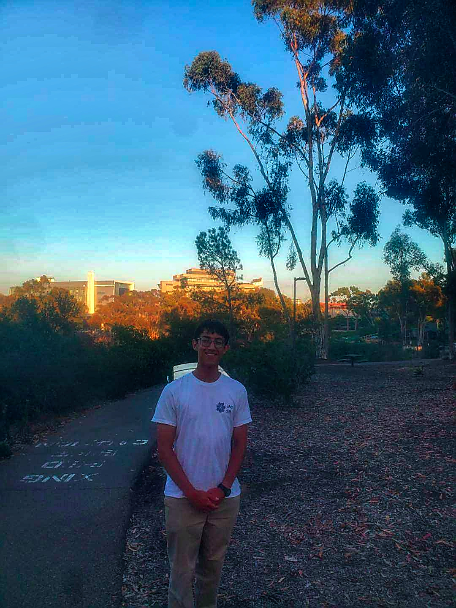

# About me

My name is Stefan Gadient, and I am a 2nd year undergraduate student majoring in computer science and applied mathematics. I am local to San Diego, and I am looking forward to CSE110. 

**Table of Contents**
- [About me](#about-me)
  - [**Background in Computer Science**](#background-in-computer-science)
  - [**Background in Mathematics**](#background-in-mathematics)
  - [**Time at UCSD**](#time-at-ucsd)
  - [**Future Goals**](#future-goals)
  - [**Hobbies**](#hobbies)
  - [**Miscellaneous**](#miscellaneous)

## **Background in Computer Science**
I came into UCSD with very little knowledge of programming, since my school (K-12th) was fairly small and heavily focused on the liberal arts. However, I became very interested in cybersecurity, which made me realize I was good with computers. I ended up becoming captain of my school's cyber team and competed in various competitions, such as CyberPatriot, Socal Cyber Cup Challenge, and the National Cyber League (NCL). Some of my most major accomplishments during this time include
1. Consistently scored top 10% out of 2000+ teams nationally in CyberPatriot
2. Won $10750 for school in Socal Cyber Cup Challenge over 2 years (JV Division) 
  - [2018](https://timesofsandiego.com/education/2018/04/05/del-norte-high-school-the-cambridge-school-take-top-honors-during-socal-cyper-cup-challenge/)
  - [2019](https://www.ndia-sd.org/2019-cyber-cup-winners/)
3. Won $2500 in [National Cyber Scholarship Challenge](https://www.nationalcyberscholarship.org/winners-2021)

A lot of effort went into teaching new team members about patching vulnerabilities in various operating systems such as Windows 10, Windows Server, Ubuntu, and Debian. In order to more efficently patch the common vulnerabilites  during the 6 hour CyberPatriot competitions, I began to look into scripting, first in Bash, and later in Powershell. Later, I took some introductory courses in Python and Java, which is where my programming journey began. 

## **Background in Mathematics**
I've been heavily invested in math for as long as I can remember. From 5th grade on, I joined the San Diego Math Circle (SDMC) and focused much of my attention on both national competitions such as the AMC (American Math Competition) and ARML (American Regional Math League), and local contests like the San Diego Math Olympiad (SDMO) and the UCSD High School Honors Contest. Some of my accomplishments included qualifying for AIME (top 2.5% of AMC10 and top 5% of AMC12 scorers are invited) and scoring top of my school from 7-12th grade. 


## **Time at UCSD** ##
In my freshman year, I continued to compete in red team cybersecurity competitions like NCL, and for mathematics, I competed in the Putnam exam. Since my primary major is Computer Science, I spent a lot more time learning Java, C, Assembly, and C++. I participated in the IEEE Fall Quarterly Project, which was my first time trying with a team to develop a standalone application, as well as Hard Hack. 

This year, I have not been as active in hackathons and projects, as I've decided to increase my coursework, and I hope to explore more specialized fields such as Software Engineering, as well as AI and Deep Learning. 

## **Future Goals**
- [x] Research (Crunching EEG data at ACTRI)
- [ ] Make a Chess AI
- [ ] SWE Internship
- [ ] ML Internship
- [ ] BS/MS Program @UCSD

## **Hobbies**
In my free time, I enjoy reading books, playing video games, and playing the piano. Some of my favorite books include the Sanderson Cosmere, and I am currently reading the Wheel of Time series by Robert Jordan. As for games, I spend quite a lot of time on Brawl Stars and chess. 


## **Miscellaneous** 
- Here is some basic python code for a Minecraft autoclicker that I made (fulfill code requirement)
```python
import pyautogui, datetime, time
pyautogui.FAILSAFE=True
time.sleep(5)
while True:
  time.click(1280,711)
  time.sleep(1.5)
```
- Favorite quote (from [poem](poem.md) by Robert Frost): 
> Two roads diverged in a wood, and I—
I took the one less traveled by,
And that has made all the difference.